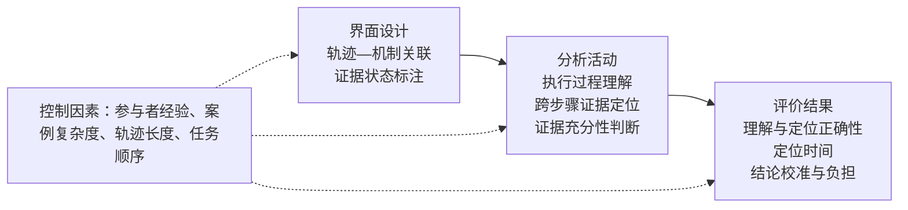

# 选题报告

## 研究背景

大语言模型智能体通过模型推理、上下文构建、工具调用、状态维护和流程控制完成多步骤任务。一次执行往往跨越提示模板、模型接口、工具适配器、中间件、状态存储和终止规则。任务结果出现异常时，开发者需要回答三个相互关联的问题：执行过程中发生了什么，相关信息经过哪些步骤与组件，异常最终对应哪一处运行机制。

智能体平台通常提供按时间排列的运行轨迹，以及描述代理、工具和任务关系的静态结构视图。时间轨迹便于查看单个事件，静态视图便于认识系统组成；故障定位还需要把某项输入、工具返回值或状态变化沿执行过程连续追踪，并回到提示模板、工具定义、控制规则或实现代码中的具体位置。随着轨迹增长，事件之间的数据传递与控制转移难以从相邻日志中直接看出，结构图中的连线也可能被理解为已经发生的运行关系。

运行材料还具有不同的证据状态。模型请求、工具返回和状态写入属于实际记录；依据追踪标识、程序规则或字段映射建立的关系属于规则推导；未采集、无法访问或无法由现有记录确定的信息属于目前未知。三类状态如果采用相同的视觉形式，使用者容易把系统补出的关系视为直接观测，也可能在关键信息缺失时作出肯定判断。

本研究以工具调用型大语言模型智能体为对象，聚焦上下文构建、工具调用、状态传递和控制/停止条件中的运行故障。研究将证据链定义为由运行事件、数据流、控制流、实现锚点和证据状态共同构成的可追溯结构，题目确定为“**大语言模型智能体故障诊断的证据链交互设计研究**”。

## 研究目的与意义

### 研究目的

本研究旨在理解开发者诊断智能体运行故障时对跨步骤、跨组件证据关联的需求，设计能够连接运行轨迹与运行机制的证据链界面，并评价证据关联与状态标注对运行理解、证据定位和结论校准的影响。研究形成三个层次的成果：故障诊断任务与证据需求模型；轨迹—机制关联及证据状态的交互设计方案；基于受控案例的实证评价结果。

### 理论意义

研究将程序调试中的信息搜寻、多表征协调和意义建构研究拓展到大语言模型智能体场景，描述开发者如何在概率性执行、跨组件传播和部分可见的运行环境中重建过程。研究进一步区分运行事件、关系推导和未知信息，建立界面设计、理解与定位活动、诊断判断之间的解释框架，为智能体可观测性的人因研究提供可操作的概念与测量方法。

### 实践意义

研究成果可用于智能体开发平台、运行监控系统和调试工具的信息架构设计。相关界面能够帮助开发者沿数据流和控制流追踪异常，快速进入对应的提示、工具、配置或代码位置，并识别结论所依据的是原始记录、规则推导还是不完整信息，从而支持故障定位、复盘沟通和协作检查。

## 国内外研究现状

程序调试研究表明，故障定位包含线索搜寻、跨表征导航和因果解释。Ko 和 Myers[@ref05; @ref06; @ref07]以“为什么发生”和“为什么没有发生”组织运行信息，将可见结果连接到执行事件和代码位置。Lawrance 等人[@ref08]运用信息觅食理论解释开发者如何根据错误消息、标识符和调用关系选择搜索路径。Cornelissen 等人[@ref33]的受控实验则显示，结构化轨迹能够改善部分程序理解任务，但效果受到任务类型、用户经验与视图协调成本影响。

分布式追踪与分析溯源研究为跨步骤证据关联提供了技术基础。X-Trace[@ref30]、Dapper[@ref32]和 Pivot Tracing[@ref31]利用追踪标识、跨度关系和先发生关系重建跨组件执行路径。Ragan 等人[@ref36]将分析溯源划分为数据、可视化、交互、洞见和理由等类型，说明不同分析任务需要记录不同层次的来源信息。上述研究共同指出，事件关联依赖明确的标识传播和生成规则，采样、缺少埋点或跨系统边界会形成无法直接填补的信息空白。

智能体可观测与交互调试工具已经支持轨迹采集、图结构分析和运行干预。AgentLens[@ref22]使用层级时间视图呈现行为演变，AgentGraph[@ref23]和 Graph of Trace[@ref24]将任务、工具与输入输出组织为图结构，AGDebugger[@ref02]与 AgentStepper[@ref18]支持暂停、单步和修改运行状态。HarnessFix[@ref20]进一步使用数据流、控制流和实现锚点连接轨迹与运行框架实现。这些工作提供了构建证据链所需的数据结构和交互基础，也表明轨迹浏览、关系理解与故障定位是不同层次的用户任务。

不确定性可视化和可解释人工智能研究关注信息来源、推导过程与判断信心。Sacha 等人[@ref39]将不确定性视为贯穿数据采集、处理、呈现和解释的属性。Guo 等人[@ref62]发现，图边不确定性的视觉编码效果与主属性编码和任务类型有关。Kaur 等人[@ref50]和 Sieker 等人[@ref56]的研究表明，专业用户也可能误解解释界面，并在理解没有改善时提高对系统的主观评价。因此，智能体故障诊断界面的评价需要同时考察答案正确性、证据选择、判断信心和任务负担。

现有研究已经形成运行轨迹、结构关系和交互调试等基础能力。本研究首先考察开发者在真实诊断活动中如何寻找、连接和核验运行证据，再根据形成性研究结果设计跨步骤关联与证据状态的呈现方式，最后在底层运行材料一致的条件下评价这些设计对故障诊断的影响。

## 研究问题

**研究问题一（RQ1）：开发者在理解智能体运行过程与定位故障时，如何跨越执行步骤和系统组件搜寻、关联与核验运行证据？这一过程中存在哪些主要困难和信息需求？**

**研究问题二（RQ2）：运行事件与数据传递、控制过程及实现机制之间的可追溯关联，如何影响开发者对执行过程的理解和故障定位表现？**

**研究问题三（RQ3）：对不同证据状态进行显式区分，如何影响开发者在运行信息不完整情境下的判断、信心校准与认知负荷？**

## 核心概念与研究范围

### 轨迹—机制关联

轨迹—机制关联连接一次实际执行与运行框架中的对应机制，包括三类关系：

1. **数据流：**上下文片段、参数、工具结果和状态值在步骤之间的来源、变换与去向；
2. **控制流：**分支选择、重试、回退、终止与下一步调度之间的执行关系；
3. **实现锚点：**运行事件对应的提示模板、工具模式、配置项、中间件规则、状态更新逻辑或代码位置。

每条关联均保留起点、终点、生成规则和原始记录入口，使使用者能够在图形关系、事件详情和实现材料之间双向定位。

### 证据状态

证据状态描述界面信息的获得方式和可核验范围：

1. **实际记录：**运行时直接采集且能够返回源记录的事件或字段；
2. **规则推导：**根据确定的追踪标识、字段映射或程序规则计算得到的关系，并显示所用规则与前提；
3. **目前未知：**现有材料无法确定的信息，包括未采集字段、不可见组件状态和无法重建的跨系统关系。

证据状态表示信息来源，不作为简单的可信度等级。实际记录可能存在采样遗漏，规则推导在前提满足时可以稳定复现，目前未知则提示使用者保留判断或补充检查。

## 研究内容与技术路线

研究依次开展形成性研究、表征设计、原型实现和正式实验。形成性研究回答 RQ1，并决定正式实验中的任务类型与界面需求；正式实验中的 A--B 比较回答 RQ2，B--C 比较回答 RQ3。

### 形成性研究

计划招募 10--14 名参与者，纳入条件为至少参与过一个工具调用型智能体项目，或具有一年以上复杂软件系统调试经验。研究采用关键事件访谈、脱敏案例回放和统一案例中的出声思考，覆盖执行过程复原、关键证据定位、跨组件关系解释和证据充分性判断等任务。

研究记录参与者的起始线索、查看顺序、跨视图跳转、关系解释、证据引用和判断依据。资料采用框架分析法，两名研究者对不少于 25% 的材料独立编码，形成稳定的编码手册后完成全量分析。输出包括任务模型、证据关联需求、常见误解、状态区分需求，以及“研究发现—设计要求—界面功能—评价指标”对应表。

### 表征设计研究

根据形成性研究结果制作 3--5 种低保真方案，比较时间轴、流程图、并列视图和按问题展开的关联视图。计划邀请 6--8 名开发者开展任务式比较走查，并邀请 3--5 名人机交互或开发者工具专家进行启发式评审。

表征评价关注六项内容：跨步骤定位是否连续，数据流和控制流是否容易区分，实现锚点是否明确，关系生成依据是否可查看，三类证据状态是否易辨认，以及界面密度与操作成本是否可接受。该阶段形成原型信息架构、视觉语义和交互规格。

### 交互原型

原型命名为“智能体运行证据链工作台”，由轨迹视图、机制视图和证据详情面板组成，提供以下功能：

1. 从异常输出、工具结果或状态变化进入相关轨迹片段；
2. 沿数据流查看值的来源、变换和传播路径；
3. 沿控制流查看分支、重试、回退和终止过程；
4. 从运行事件跳转到提示、工具定义、配置、规则或代码锚点；
5. 查看关系的生成规则、输入字段和适用前提；
6. 通过文字标签与视觉编码区分实际记录、规则推导和目前未知；
7. 记录参与者选取的证据、最终判断与信心分配。

### 正式实验

计划招募 36--48 名具有软件开发经验的参与者，记录其智能体开发经历、调试年限和基础能力。实验优先采用被试内设计，每名参与者先完成练习任务，再完成 6 个正式案例。条件顺序和案例—条件映射采用拉丁方与分块随机化平衡。样本量根据预先设定的最小实际重要效应进行模拟功效分析。

**表：实验条件及其对应研究问题**

| 条件 | 界面内容 | 研究作用 |
| --- | --- | --- |
| A 基础视图 | 原始时间轨迹、事件详情、搜索筛选，以及独立的静态组件结构图 | 提供常用分析材料与操作基线 |
| B 关联视图 | A 的全部内容，加上数据流、控制流和实现锚点；关系可返回原始事件与生成规则 | 与 A 比较，回答 RQ2 |
| C 状态视图 | B 的全部内容，加上“实际记录”“规则推导”“目前未知”的文字与视觉标记 | 与 B 比较，回答 RQ3 |

三种条件使用相同的底层运行记录、静态结构信息和案例问题。B 与 C 中的关系由同一套确定性规则生成，C 只增加状态说明。实验任务和主要指标在数据收集前预注册，A--B 与 B--C 为预设比较。

## 研究材料与案例构建

形成性研究可使用脱敏自然案例与受控案例。正式实验使用能够固定运行材料和判断依据的受控案例，覆盖上下文构建、工具调用、状态传递和控制/停止条件。每个案例包含执行过程理解题、证据定位题和故障判断题，并根据形成性研究识别出的典型任务确定信息规模与关键关系。

案例采用“固定任务—受控注入—轨迹冻结—反事实验证”的方式构建。研究冻结模型版本、采样设置、工具输出和环境快照，注入指定运行故障后保存三种条件共同使用的记录，再通过移除故障或替换正确状态进行反事实重放。两名智能体系统专家独立核对事件关系、实现锚点和答案依据，由第三位专家处理分歧。

为评价证据状态，部分任务提供足以作出判断的记录，部分任务保留自然产生或受控移除的关键观测缺口。缺口类型由形成性研究中的实际困难确定，正确回答为“现有证据无法确定”并说明缺少的信息。充分与不充分案例在故障类型、轨迹长度和任务难度上配对，所有条件接收完全相同的底层记录。

## 评价指标与分析方法

**表：研究问题、评价指标与操作化方式**

| 对应问题 | 指标 | 操作化方式 |
| --- | --- | --- |
| RQ2 | 运行理解正确性 | 对执行顺序、数据来源、分支条件和状态变化问题的答案得分 |
| RQ2 | 证据定位准确率 | 所选事件、字段与实现锚点相对于专家答案的准确率、召回率和综合得分 |
| RQ2 | 定位时间 | 从呈现案例到首次提交正确证据集合的时间 |
| RQ3 | 无依据肯定判断率 | 在关键信息不足任务中选择确定原因或确定关系的比例 |
| RQ3 | 结论校准 | 对各答案分配概率，使用 Brier 分数及置信—正确性关系评价 |
| RQ3 | 任务负担 | NASA-TLX、操作数量和主观可用性；同时记录状态标记的理解正确率 |

运行理解与证据定位得分由案例答案和操作日志共同计算。需要人工评分的开放解释由不知道界面条件的评分者依据手册评分，不少于 25% 的样本进行双人独立评分，并根据变量类型报告组内相关系数或加权 Kappa。

定量分析根据因变量类型采用线性或广义线性混合效应模型，将参与者和案例设为交叉随机效应，在数据支持时加入界面条件的参与者随机斜率；固定效应包括界面条件、经验水平、任务顺序和案例复杂度。RQ2 重点报告 B--A 对比，RQ3 重点报告 C--B 对比，并报告效应量与置信区间。任务负担采用预注册的可接受范围进行解释，使结论同时反映效果与使用成本。访谈和出声思考用于说明界面如何影响关系理解与证据判断。

## 研究概念框架

**图：证据链界面影响智能体故障诊断的概念框架**

研究路线由任务发现、设计形成和效果评价构成。RQ1 的形成性研究识别开发者实际遇到的关联需求与误解；表征研究将需求转化为可辨认、可追溯的界面语义；正式实验在运行记录一致的条件下依次评价轨迹—机制关联和证据状态标注。

## 可行性、风险与伦理

### 研究可行性

研究可复用现有智能体运行框架、轨迹记录和测试任务。实现工作集中于事件标准化、关系计算、实现锚点映射和界面联动，无需训练新的基础模型。案例范围集中于四类可注入、可回放的运行故障，适合在硕士研究周期内完成。

### 研究风险与控制

参与者经验差异通过基础能力测量、条件平衡和统计控制处理。案例关系由确定性规则生成并经专家核对，降低自动生成关系错误对实验结果的影响。模型输出波动通过冻结轨迹和反事实重放控制。多视图界面的学习成本通过练习任务、顺序平衡和任务负担测量处理。正式招募不足时，依据功效模拟调整每名参与者完成的案例数量，同时保留三种条件和关键案例类型的覆盖。

### 研究伦理与数据管理

研究将在获得伦理审查批准后招募参与者。知情同意书说明研究目的、屏幕/语音/交互日志的记录范围、退出权利和补偿安排。自然案例移除代码、密钥、客户数据和组织标识；研究数据加密存储，限定访问人员，并说明保留期限与删除方式。未经充分脱敏的材料不上传至第三方生成式人工智能服务。

## 进度安排

**表：研究进度计划**

| 阶段 | 时间 | 主要任务与成果 |
| --- | --- | --- |
| 研究准备与案例构建 | 2026.09--2026.10 | 补充文献，提交伦理材料，建立关系规则、实现锚点与案例答案手册 |
| 形成性研究 | 2026.11--2027.01 | 开展案例回放、统一任务和访谈，形成任务模型与证据关联需求 |
| 表征探索与原型设计 | 2027.02--2027.06 | 比较关联与状态表征，完成原型、专家评审和预实验 |
| 正式实验 | 2027.07--2027.10 | 完成功效模拟、预注册、正式实验和访谈资料收集 |
| 综合分析与论文初稿 | 2027.11--2028.02 | 完成统计与质性分析、设计原则归纳和论文初稿 |
| 论文修改与答辩 | 2028.03--2028.05 | 完成论文修改、送审、答辩准备和研究材料归档 |

## 预期成果与创新点

预期成果包括：智能体故障诊断任务与证据关联需求模型；轨迹—机制关联和证据状态的交互设计原则；智能体运行证据链工作台原型；关于两类界面设计对理解、定位和结论校准影响的实验结果；配套的受控案例与评价材料。

研究创新点包括：

1. **研究对象：**以运行框架的执行过程为分析单位，研究模型、工具、状态和控制机制共同作用下的故障诊断；
2. **交互设计：**将分散事件组织为数据流、控制流和实现锚点，并保持图形关系、原始记录与实现材料之间的双向追溯；
3. **证据表达：**以“实际记录—规则推导—目前未知”描述信息来源与边界，支持使用者判断现有材料能够回答到何种程度；
4. **实证评价：**在底层运行记录相同的条件下，通过 A--B 和 B--C 两个预设比较分别评价关系呈现与状态标注的作用。

---

注：文中 `[@refXX]` 为源 LaTeX 文献引用键，对应 `ref/report.bib` 中的条目。
